# IoT Integration Project — Arsitektur & Penjelasan Lengkap

> **Project:** `iot-integration-project`
> **Branch:** `feat/websocket-json-integration`
> **Teknologi Utama:** C++17, gRPC, Protobuf, OpenDDS (RTPS), WebSocket, RapidJSON, spdlog, Boost, CMake, Conan, Docker
> **Tujuan:** Aplikasi **IoT Bridge** yang menerima data sensor melalui gRPC, kemudian mem-*broadcast* data tersebut secara simultan ke **WebSocket** (format JSON) dan **OpenDDS** (publish DDS topic) menggunakan arsitektur **Bridge + Adapter Pattern**.

---

## Daftar Isi

1. [Gambaran Umum Project](#1-gambaran-umum-project)
2. [Struktur Folder Lengkap](#2-struktur-folder-lengkap)
3. [Penjelasan Setiap Folder & File](#3-penjelasan-setiap-folder--file)
4. [Konsep OOP yang Digunakan](#4-konsep-oop-yang-digunakan)
5. [Design Patterns](#5-design-patterns)
6. [gRPC Streaming Patterns & Visualization](#55-grpc-streaming-patterns--visualization)
7. [Extend gRPC Service — Request-Response Features](#56-extend-grpc-service--menambah-request-response-features)
8. [Diagram — Arsitektur Keseluruhan](#6-diagram--arsitektur-keseluruhan)
9. [Diagram — Class Hierarchy (OOP)](#7-diagram--class-hierarchy-oop)
10. [Diagram — Data Flow (Sensor Data Pipeline)](#8-diagram--data-flow-sensor-data-pipeline)
11. [Diagram — Sequence (Alur Runtime)](#9-diagram--sequence-alur-runtime)
12. [Diagram — Proto & IDL Code Generation](#10-diagram--proto--idl-code-generation)
13. [Diagram — Folder Structure](#11-diagram--folder-structure)
14. [Cara Kerja Aplikasi (Step by Step)](#12-cara-kerja-aplikasi-step-by-step)
15. [Docker Deployment](#13-docker-deployment)
16. [Environment Variables](#14-environment-variables)
17. [Cara Generate Proto & IDL Stubs](#15-cara-generate-proto--idl-stubs)

---

## 1. Gambaran Umum Project

Project ini adalah **IoT Bridge Application** — sebuah gateway yang menghubungkan tiga protokol komunikasi berbeda dalam satu aplikasi:

| Protokol | Peran | Port Default |
|----------|-------|-------------|
| **gRPC** | Input — menerima data sensor dari client | `50051` |
| **WebSocket** | Output — broadcast JSON ke browser/dashboard | `9002` |
| **OpenDDS (RTPS)** | Output — publish data ke DDS domain (peer-to-peer) | RTPS auto-discovery |

**Alur utama:**
```
Sensor Client  ──gRPC──►  IoT Bridge  ──WebSocket──►  Dashboard / Browser
                                       ──OpenDDS───►  DDS Subscriber
```

**Fitur gRPC yang diimplementasikan (4 mode):**
1. **Unary** (`SendSensorData`) — kirim satu data, terima satu respon
2. **Client Streaming** (`StreamSensorData`) — kirim banyak data, terima satu ringkasan
3. **Server Streaming** (`MonitorSensor`) — kirim satu perintah, terima data kontinu
4. **Bidirectional Streaming** (`InteractiveSensor`) — komunikasi dua arah real-time

**Hubungan dengan project template:**
```
cpp-simple-project-main  →  Template dasar (OOP skeleton)
       ↓
simple-grpc-cpp          →  + gRPC Server
       ↓
simple-websocket-cpp     →  + WebSocket Server
       ↓
simple-odds-cpp          →  + OpenDDS Publisher
       ↓
iot-integration-project  →  ★ GABUNGAN SEMUA (gRPC + WebSocket + DDS + Docker)
```

---

## 2. Struktur Folder Lengkap

```
iot-integration-project/
├── CMakeLists.txt                    # Build system — links semua library
├── CMakeUserPresets.json             # CMake presets (Conan integration)
├── conanfile.txt                     # 13 dependencies (gRPC, boost, websocketpp, dll)
├── Dockerfile                        # Multi-stage Docker build (OpenDDS from source)
├── docker-compose.yaml               # Container orchestration
├── .env                              # Environment variables (runtime config)
├── .env.example                      # Template env (blank, aman untuk git)
├── .gitignore                        # Ignore .env, build/, dll
├── rtps.ini                          # OpenDDS RTPS discovery config
├── rtps.test.ini                     # RTPS config untuk testing
├── simple.ior                        # IOR file (legacy, unused)
├── generate_proto                    # Script: generate protobuf + gRPC stubs
├── generate_idl                      # Script: generate OpenDDS IDL TypeSupport
│
├── build/                            # Conan-generated CMake configs (auto-generated)
│
├── docker/
│   └── CMakeLists.txt                # Docker-specific CMake (self-contained paths)
│
├── idl/                              # === OpenDDS IDL ===
│   └── SensorData/
│       ├── SensorData.idl            # IDL definition (module Messengger)
│       ├── SensorDataC.cpp/h         # Generated: Common types
│       ├── SensorDataS.cpp/h         # Generated: Skeleton
│       ├── SensorDataTypeSupportC.cpp/h      # Generated: TypeSupport client
│       ├── SensorDataTypeSupportS.cpp/h      # Generated: TypeSupport skeleton
│       ├── SensorDataTypeSupportImpl.cpp/h   # Generated: TypeSupport implementation
│       └── SensorDataTypeSupport.idl         # Generated: TypeSupport IDL
│
├── proto/                            # === Protobuf / gRPC ===
│   └── sensor.proto                  # Service definition (4 RPC methods)
│
└── src/                              # === SOURCE CODE ===
    ├── app.cpp                       # Entry point (main) — orchestrator utama
    │
    ├── adapters/                     # ★ ADAPTER LAYER (Bridge + Observer Pattern)
    │   ├── abstract_adapters/
    │   │   └── observable/
    │   │       ├── interface_observable.h     # Interface: IObservable (add/remove/notify)
    │   │       └── observable.h              # Concrete: Observable (base class)
    │   ├── interface_adapters/
    │   │   ├── interface_bridge_manager.h     # Interface: IBridgeManager
    │   │   └── interface_transport_adapter.h  # Interface: ITransportAdapter
    │   └── service_adapters/
    │       ├── bridge_manager.h/cpp           # Concrete: BridgeManager (relay hub)
    │       ├── dds_adapters/
    │       │   └── dds_adapter.h/cpp          # Adapter: DDS → ITransportAdapter
    │       └── websocket_adapters/
    │           └── websocket_adapter.h/cpp    # Adapter: WebSocket → ITransportAdapter
    │
    ├── controllers/                  # gRPC SERVICE LAYER + OBSERVABLE
    │   ├── sensor_controller.h       # gRPC Service + Observable (Multiple Inheritance)
    │   └── sensor_controller.cpp     # 4 RPC implementations + notify_observers()
    │
    ├── dds/                          # DDS PUBLISHER LAYER
    │   ├── dds_publisher.h           # OpenDDS publisher wrapper
    │   └── dds_publisher.cpp         # DomainParticipant, Topic, DataWriter
    │
    ├── handlers/                     # ★ HANDLER LAYER (Observer Pattern)
    │   ├── observer/
    │   │   └── observer.h            # Observer interface (on_sensor_data)
    │   ├── sensor_data_log_handler/
    │   │   └── sensor_data_log_handler.h  # Concrete Observer: log detail data
    │   └── sensor_data_validator/
    │       └── sensor_data_validator.h    # Concrete Observer: validasi data
    │
    ├── utils/                        # UTILITY LAYER
    │   ├── json_helper.h             # Protobuf → JSON converter (RapidJSON)
    │   └── log_util/
    │       └── logger.h              # Logger initializer (spdlog)
    │
    └── websocket/                    # WEBSOCKET SERVER LAYER
        ├── ws_server.h               # WebSocket server (websocketpp)
        └── ws_server.cpp             # listen, broadcast, connection management
```

---

## 3. Penjelasan Setiap Folder & File

### 3.1 Root Configuration Files

| File | Penjelasan |
|------|-----------|
| `CMakeLists.txt` | Build system CMake — mendefinisikan target `iot_bridge`, link proto generation, IDL files, dan semua library dependencies |
| `conanfile.txt` | Package manager — 13 dependencies termasuk gRPC, protobuf, websocketpp, spdlog, rapidjson, dll |
| `Dockerfile` | Multi-stage build: (1) build OpenDDS dari source, install Conan deps, compile C++; (2) runtime minimal dengan binary + libs |
| `docker-compose.yaml` | Orchestration: satu service `iot-bridge` dengan env_file dan port mapping dari `.env` |
| `.env` / `.env.example` | Environment variables: hostname, port, DDS domain, log level. `.env` di-gitignore, `.env.example` template kosong |
| `rtps.ini` | Config OpenDDS RTPS discovery — `DCPSDefaultDiscovery=DEFAULT_RTPS`, transport `rtps_udp` |
| `generate_proto` | Bash script: jalankan `protoc` + `grpc_cpp_plugin` untuk generate `sensor.pb.cc/h` dan `sensor.grpc.pb.cc/h` |
| `generate_idl` | Bash script: jalankan `tao_idl` + `opendds_idl` untuk generate TypeSupport files dari `SensorData.idl` |

### 3.2 Proto Service Definition — `proto/sensor.proto`

Mendefinisikan **4 mode gRPC** dalam satu service:

```protobuf
syntax = "proto3";
package iot;

service SensorService {
  rpc SendSensorData (SensorRequest) returns (SensorResponse);          // Unary
  rpc StreamSensorData (stream SensorRequest) returns (SensorResponse); // Client Streaming
  rpc MonitorSensor (SensorRequest) returns (stream SensorResponse);    // Server Streaming
  rpc InteractiveSensor (stream SensorRequest) returns (stream SensorResponse); // Bidi
}

message SensorRequest {
    int32 sensor_id = 1;
    string sensor_name = 2;
    double temperature = 3;
    double humidity = 4;
    double pressure = 5;
    double light_intensity = 6;
    int64 timestamp = 7;
    string location = 8;
}

message SensorResponse {
    bool success = 1;
    string message = 2;
    int64 processed_timestamp = 3;
}
```

### 3.3 IDL Definition — `idl/SensorData/SensorData.idl`

Mendefinisikan **DDS topic type** untuk OpenDDS publish:

```idl
module Messengger {
    @topic
    struct Message {
        long sensor_id;
        string sensor_name;
        double temperature;
        double humidity;
        double pressure;
        double light_intensity;
        long long timestamp;
        string location;
    };
};
```

Field-field di IDL **identik** dengan `SensorRequest` di proto — data yang diterima gRPC langsung di-mapping ke DDS message tanpa transformasi.

### 3.4 `src/app.cpp` — Entry Point (Orchestrator)

File ini adalah **jantung aplikasi** — menginisialisasi semua komponen dan menjalankan server:

```cpp
int main(int argc, char* argv[]) {
    utils::init_logger();                              // 1. Setup spdlog
    
    g_ws_server = std::make_shared<WsServer>();        // 2. Buat WebSocket server
    g_dds_pub = std::make_shared<DdsPublisher>();      // 3. Buat DDS publisher
    
    // 4. Inject -DCPSConfigFile rtps.ini ke DDS args
    // (supaya RTPS discovery aktif tanpa InfoRepo)
    
    g_dds_pub->init(new_argc, new_argv.data());        // 5. Init DDS (participant, topic, writer)
    
    init_bridge();                                     // 6. Buat BridgeManager + register adapters
    
    std::thread ws_thread(run_ws_server);              // 7. Jalankan WebSocket di thread terpisah
    ws_thread.detach();
    
    run_grpc_server();                                 // 8. Jalankan gRPC di main thread (blocking)
}
```

**Helper functions:**
- `get_env_string()` — baca environment variable string dengan fallback
- `get_env_int()` — baca environment variable integer dengan fallback
- `run_grpc_server()` — setup `grpc::ServerBuilder`, register `SensorController`, **register observers** (LogHandler + Validator), blocking `Wait()`
- `run_ws_server()` — panggil `WsServer::run()` di thread terpisah
- `init_bridge()` — buat `BridgeManager`, register `WebSocketAdapter` dan `DdsAdapter`

**Observer registration di `run_grpc_server()`:**
```cpp
auto service = std::make_shared<SensorController>(g_bridge);

auto log_handler = std::make_shared<SensorDataLogHandler>();  // Observer 1
auto validator   = std::make_shared<SensorDataValidator>();   // Observer 2

service->add_observer(log_handler);   // Register: log detail data sensor
service->add_observer(validator);     // Register: validasi data sensor
```

### 3.5 `src/controllers/sensor_controller.h/cpp` — gRPC Service + Observable

Class ini menggabungkan **DUA peran** melalui **Multiple Inheritance**:
1. **gRPC Service** (extends `SensorService::Service`) → handle RPC calls
2. **Observable** (extends `Observable`) → notify observers saat data masuk

```cpp
class SensorController final : public iot::SensorService::Service, public Observable {
    // ...
};
```

Implements **4 RPC method**:

| Method | Tipe | Fungsi |
|--------|------|--------|
| `SendSensorData()` | Unary | Terima satu `SensorRequest`, **notify observers**, relay ke bridge, return `SensorResponse` |
| `StreamSensorData()` | Client Streaming | Terima stream, **notify + relay** setiap message, return ringkasan |
| `MonitorSensor()` | Server Streaming | Terima satu request, kirim 5 response update dengan interval 1 detik |
| `InteractiveSensor()` | Bidirectional | Baca request → **notify + relay** → echo response kembali ke client |

**Setiap method** memanggil `notify_observers(request)` (Observer Pattern) **lalu** `bridge_->broadcast_sensor_data(request)` (Bridge Pattern):

```cpp
grpc::Status SensorController::SendSensorData(grpc::ServerContext* context,
                                              const iot::SensorRequest* request,
                                              iot::SensorResponse* response) {
    spdlog::info("Incoming gRPC -> Sensor ID: {}, Temp: {}C",
                 request->sensor_id(), request->temperature());
    
    // ★ OBSERVER PATTERN: Notify semua observer (LogHandler, Validator, dll)
    notify_observers(*request);
    
    // ★ BRIDGE PATTERN: Broadcast ke semua transport adapters (WebSocket, DDS)
    if (bridge_) {
        bridge_->broadcast_sensor_data(*request);
    }
    
    response->set_success(true);
    response->set_message("Bridge: Data processed successfully");
    return grpc::Status::OK;
}
```

### 3.6 `src/adapters/` — Bridge & Adapter Layer

Ini adalah **inti arsitektur** project. Layer ini menerapkan **Bridge Pattern** + **Adapter Pattern**.

#### 3.6.1 `interface_adapters/interface_transport_adapter.h` — Interface

Kontrak yang harus dipenuhi semua transport adapter:

```cpp
class ITransportAdapter {
public:
    virtual ~ITransportAdapter() = default;
    virtual bool init() = 0;                             // Inisialisasi adapter
    virtual void send(const iot::SensorRequest& request) = 0;  // Kirim data
    virtual std::string name() const = 0;                // Nama adapter (untuk logging)
};
```

#### 3.6.2 `interface_adapters/interface_bridge_manager.h` — Interface

Kontrak untuk bridge manager:

```cpp
class IBridgeManager {
public:
    virtual ~IBridgeManager() = default;
    virtual void add_adapter(std::shared_ptr<ITransportAdapter> adapter) = 0;
    virtual void broadcast_sensor_data(const iot::SensorRequest& request) = 0;
};
```

#### 3.6.3 `service_adapters/bridge_manager.h/cpp` — Concrete Bridge

Hub sentral yang menyimpan list adapter dan broadcast ke semuanya:

```cpp
class BridgeManager {
public:
    void add_adapter(std::shared_ptr<ITransportAdapter> adapter);
    void broadcast_sensor_data(const iot::SensorRequest& request);
private:
    std::vector<std::shared_ptr<ITransportAdapter>> adapters_;
};

void BridgeManager::broadcast_sensor_data(const iot::SensorRequest& request) {
    for (auto& adapter : adapters_) {
        if (adapter) {
            adapter->send(request);  // polymorphic call
        }
    }
}
```

#### 3.6.4 `service_adapters/websocket_adapters/websocket_adapter.h/cpp`

Adapter yang membungkus `WsServer` dan mengkonversi Protobuf → JSON:

```cpp
void WebSocketAdapter::send(const iot::SensorRequest& request) {
    std::string json_payload = utils::sensor_to_json(&request);  // Protobuf → JSON
    ws_server_->broadcast(json_payload);                         // Broadcast ke semua client
}
```

#### 3.6.5 `service_adapters/dds_adapters/dds_adapter.h/cpp`

Adapter yang membungkus `DdsPublisher` dan meneruskan data ke DDS:

```cpp
void DdsAdapter::send(const iot::SensorRequest& request) {
    dds_publisher_->publish(
        request.sensor_id(), request.sensor_name(),
        request.temperature(), request.humidity(),
        request.pressure(), request.light_intensity(),
        request.timestamp(), request.location()
    );
}
```

### 3.7 `src/dds/dds_publisher.h/cpp` — OpenDDS Publisher

Wrapper lengkap untuk OpenDDS publishing pipeline:

```cpp
class DdsPublisher {
public:
    bool init(int argc, char* argv[]);  // Setup DomainParticipant → Topic → Publisher → DataWriter
    void publish(long id, const std::string& name, ...);  // Write Messengger::Message ke DDS

private:
    DDS::DomainParticipant_var participant_;
    DDS::Topic_var topic_;
    DDS::Publisher_var publisher_;
    Messengger::MessageDataWriter_var writer_;  // Typed DataWriter dari generated IDL
};
```

**`init()` flow:**
1. `TheParticipantFactoryWithArgs(argc, argv)` — parse `-DCPSConfigFile rtps.ini`
2. `create_participant(domain, ...)` — buat DomainParticipant di domain dari env `DDS_DOMAIN`
3. `Messengger::MessageTypeSupport::register_type()` — register tipe IDL
4. `create_topic()` — buat topic dari env `TEST_TOPIC`
5. `create_publisher()` → `create_datawriter()` → narrow ke `MessageDataWriter`

**`publish()` flow:**
1. Buat `Messengger::Message` struct
2. Isi semua field (sensor_id, temperature, humidity, dll.)
3. `writer_->write(msg, DDS::HANDLE_NIL)` — publish ke DDS domain

### 3.8 `src/websocket/ws_server.h/cpp` — WebSocket Server

Server WebSocket menggunakan `websocketpp` library (Boost.Asio, tanpa TLS):

```cpp
class WsServer {
public:
    WsServer();                           // Init asio, set_reuse_addr(true)
    void run(uint16_t port);              // Listen + accept + run event loop
    void broadcast(const std::string& message);  // Kirim ke semua connected clients

private:
    server m_server;                      // websocketpp::server<asio_no_tls>
    std::set<connection_hdl> m_connections;  // Active connections
    std::mutex m_mutex;                   // Thread safety untuk broadcast
};
```

**Fitur:**
- `set_reuse_addr(true)` — mencegah error `Address already in use` saat restart
- Thread-safe `broadcast()` menggunakan `std::mutex`
- Graceful error handling dengan try-catch di `run()`

### 3.9 `src/utils/json_helper.h` — Protobuf → JSON Converter

Mengkonversi `SensorRequest` (Protobuf) ke JSON string menggunakan RapidJSON:

```cpp
inline std::string sensor_to_json(const iot::SensorRequest* request) {
    rapidjson::Document doc;
    doc.SetObject();
    doc.AddMember("sensor_id", request->sensor_id(), allocator);
    doc.AddMember("temperature", request->temperature(), allocator);
    doc.AddMember("humidity", request->humidity(), allocator);
    doc.AddMember("location", Value(request->location().c_str(), allocator), allocator);
    // ... serialize to string
}
```

### 3.10 `src/utils/log_util/logger.h` — Logger Initializer

Inisialisasi spdlog dengan level dari environment variable `LOG_LEVEL`:

```cpp
inline void init_logger() {
    spdlog::set_pattern("[%Y-%m-%d %H:%M:%S.%e] [%^%l%$] %v");
    const char* level_env = std::getenv("LOG_LEVEL");
    std::string level = level_env ? std::string(level_env) : "info";
    spdlog::set_level(parse_log_level(level));
}
```

Mendukung level: `trace`, `debug`, `info` (default), `warn`, `error`, `critical`.

### 3.11 `src/handlers/observer/observer.h` — Observer Interface

Interface yang mendefinisikan kontrak untuk semua observer:

```cpp
class Observer {
public:
    virtual ~Observer() = default;
    virtual void on_sensor_data(const iot::SensorRequest& request) = 0;  // Dipanggil saat data masuk
    virtual std::string observer_name() const = 0;                       // Nama observer (untuk log)
};
```

Setiap concrete observer **WAJIB** implement `on_sensor_data()` dan `observer_name()`.

### 3.12 `src/adapters/abstract_adapters/observable/` — Observable Layer

#### `interface_observable.h` — IObservable Interface

```cpp
class IObservable {
public:
    virtual ~IObservable() = default;
    virtual void add_observer(std::shared_ptr<Observer> observer) = 0;
    virtual void remove_observer(std::shared_ptr<Observer> observer) = 0;
    virtual void notify_observers(const iot::SensorRequest& request) = 0;
};
```

#### `observable.h` — Observable Concrete Base

Implementasi konkret yang menyimpan daftar observers dan memanggil `on_sensor_data()` pada setiap observer. Menggunakan `std::mutex` untuk thread-safety:

```cpp
class Observable : public IObservable {
public:
    void add_observer(std::shared_ptr<Observer> observer) override {
        std::lock_guard<std::mutex> lock(observer_mutex_);
        observers_.push_back(observer);
    }

    void notify_observers(const iot::SensorRequest& request) override {
        std::lock_guard<std::mutex> lock(observer_mutex_);
        for (auto& observer : observers_) {
            observer->on_sensor_data(request);  // ← polymorphic call!
        }
    }
protected:
    std::vector<std::shared_ptr<Observer>> observers_;
    std::mutex observer_mutex_;
};
```

`SensorController` mewarisi dari `Observable`, sehingga bisa langsung memanggil `notify_observers()` di setiap RPC method.

### 3.13 `src/handlers/sensor_data_log_handler/` — Concrete Observer #1

Observer yang mencatat **semua field** data sensor ke console dalam format terstruktur:

```cpp
class SensorDataLogHandler : public Observer {
public:
    void on_sensor_data(const iot::SensorRequest& request) override {
        spdlog::info("┌─────────── [DataLogger] Sensor Report ───────────┐");
        spdlog::info("│ Sensor ID      : {}",   request.sensor_id());
        spdlog::info("│ Temperature    : {}°C", request.temperature());
        spdlog::info("│ Humidity       : {}%",  request.humidity());
        // ... semua field
        spdlog::info("└─────────────────────────────────────────────────┘");
        ++log_count_;
    }
    std::string observer_name() const override { return "SensorDataLogHandler"; }
private:
    int log_count_ = 0;
};
```

**Use case:** Debugging, audit trail, monitoring real-time.

### 3.14 `src/handlers/sensor_data_validator/` — Concrete Observer #2

Observer yang **memvalidasi** data sensor dan mengeluarkan warning jika abnormal:

```cpp
class SensorDataValidator : public Observer {
public:
    void on_sensor_data(const iot::SensorRequest& request) override {
        // Validasi: sensor_id > 0, temperature -50~100°C,
        //           humidity 0~100%, pressure 300~1100 hPa,
        //           sensor_name & location tidak kosong
        if (request.temperature() > 100.0)
            spdlog::warn("[Validator] ⚠ ABNORMAL TEMP: {}°C", request.temperature());
        // ... validasi lainnya
    }
    std::string observer_name() const override { return "SensorDataValidator"; }
private:
    int anomaly_count_ = 0;
};
```

**Penting:** Observer ini **TIDAK menghentikan** alur data. Data tetap diteruskan ke Bridge. Observer hanya "mengamati" — tidak mengubah flow.

**Aturan validasi:**
| Field | Rule | Warning |
|-------|------|---------|
| `sensor_id` | `> 0` | `INVALID: sensor_id` |
| `temperature` | `-50 ~ 100°C` | `ABNORMAL TEMP` |
| `humidity` | `0 ~ 100%` | `INVALID HUMIDITY` |
| `pressure` | `300 ~ 1100 hPa` | `ABNORMAL PRESSURE` |
| `sensor_name` | not empty | `MISSING: sensor_name` |
| `location` | not empty | `MISSING: location` |

### 3.15 Dependencies (conanfile.txt)

| Package | Version | Fungsi |
|---------|---------|--------|
| `grpc` | 1.54.3 | Framework gRPC (server + client stubs) |
| `protobuf` | 3.21.12 | Protocol Buffers serialization |
| `spdlog` | 1.14.1 | Structured logging |
| `fmt` | 10.2.1 | String formatting (dipakai spdlog) |
| `abseil` | 20230802.1 | Google core libraries (dependency gRPC) |
| `boost` | 1.83.0 | General utilities + Asio (WebSocket engine) |
| `websocketpp` | 0.8.2 | WebSocket server library |
| `rapidjson` | 1.1.0 | JSON serialization (Protobuf → JSON) |
| `libuv` | 1.46.0 | Async I/O event loop |
| `uwebsockets` | 20.62.0 | Micro WebSocket (alternative/future) |
| `usockets` | — | Socket library (dependency uwebsockets) |
| `openssl` | 3.2.0 | TLS/SSL (dependency gRPC + Boost) |
| `zlib` | 1.3.1 | Compression (dependency gRPC) |
| `gtest` | 1.14.0 | Unit testing framework |

**External (non-Conan):**
| Library | Version | Build |
|---------|---------|-------|
| `OpenDDS` | 3.29.1 | Compiled from source (`./configure && make`) |
| `ACE/TAO` | (bundled) | Bundled with OpenDDS |

---

## 4. Konsep OOP yang Digunakan

### 4.1 Abstraction (Abstraksi)

Abstraksi dilakukan melalui **interface classes** yang hanya mendefinisikan kontrak tanpa implementasi:

| Interface | File | Pure Virtual Methods |
|-----------|------|---------------------|
| `ITransportAdapter` | `interface_transport_adapter.h` | `init()`, `send()`, `name()` |
| `IBridgeManager` | `interface_bridge_manager.h` | `add_adapter()`, `broadcast_sensor_data()` |
| `IObservable` | `interface_observable.h` | `add_observer()`, `remove_observer()`, `notify_observers()` |
| `Observer` | `observer.h` | `on_sensor_data()`, `observer_name()` |

**Mengapa penting?** Controller (`SensorController`) TIDAK perlu tahu apakah data dikirim ke WebSocket atau DDS. Ia hanya memanggil `bridge_->broadcast_sensor_data()` — abstraksi menyembunyikan detail transport.

### 4.2 Inheritance (Pewarisan)

```
ITransportAdapter (interface)
├── DdsAdapter       → wrap DdsPublisher, implement send()
└── WebSocketAdapter → wrap WsServer, implement send()

IObservable (interface)
└── Observable (concrete base) → add/remove/notify observers
    └── SensorController → gRPC Service + Observable (Multiple Inheritance)

Observer (interface)
├── SensorDataLogHandler  → log detail data sensor ke console
└── SensorDataValidator   → validasi data, warning jika abnormal

iot::SensorService::Service (gRPC generated base)
└── SensorController → implement 4 RPC methods + notify observers
```

Setiap adapter mewarisi dari `ITransportAdapter` dan **wajib** mengimplementasikan `init()`, `send()`, dan `name()`.

**Multiple Inheritance di `SensorController`:**

`SensorController` mewarisi dari **DUA** base class sekaligus:
```cpp
class SensorController final : public iot::SensorService::Service, public Observable { ... };
```
- Dari `SensorService::Service` → kemampuan handle gRPC RPC calls
- Dari `Observable` → kemampuan manage dan notify observers

Ini adalah contoh **Multiple Inheritance** yang aman karena:
1. `SensorService::Service` adalah gRPC-generated abstract class
2. `Observable` adalah implementation class (dari `IObservable` interface)
3. Tidak ada diamond problem karena kedua parent class tidak berbagi ancestor

### 4.3 Polymorphism (Polimorfisme)

Terjadi di **dua tempat**:

**1. Bridge Pattern — `BridgeManager::broadcast_sensor_data()`:**

```cpp
for (auto& adapter : adapters_) {
    adapter->send(request);  // ← polymorphic call!
}
```
- `adapter` bertipe `std::shared_ptr<ITransportAdapter>` (interface pointer)
- Runtime dispatch: `DdsAdapter::send()` atau `WebSocketAdapter::send()` dipanggil

**2. Observer Pattern — `Observable::notify_observers()`:**

```cpp
for (auto& observer : observers_) {
    observer->on_sensor_data(request);  // ← polymorphic call!
}
```
- `observer` bertipe `std::shared_ptr<Observer>` (interface pointer)
- Runtime dispatch: `SensorDataLogHandler::on_sensor_data()` atau `SensorDataValidator::on_sensor_data()`

- **Menambah transport baru** (misal MQTT) cukup buat class baru yang implement `ITransportAdapter`, tanpa mengubah `BridgeManager`
- **Menambah handler baru** (misal `DatabaseWriter`) cukup buat class baru yang implement `Observer`, tanpa mengubah `SensorController`

### 4.4 Encapsulation (Enkapsulasi)

| Class | Private Members | Public Interface |
|-------|----------------|-----------------|
| `WsServer` | `m_server`, `m_connections`, `m_mutex` | `run()`, `broadcast()` |
| `DdsPublisher` | `participant_`, `topic_`, `publisher_`, `writer_` | `init()`, `publish()` |
| `BridgeManager` | `adapters_` (vector) | `add_adapter()`, `broadcast_sensor_data()` |
| `DdsAdapter` | `dds_publisher_` | `init()`, `send()`, `name()` |
| `WebSocketAdapter` | `ws_server_` | `init()`, `send()`, `name()` |
| `Observable` | `observers_`, `observer_mutex_` | `add_observer()`, `remove_observer()`, `notify_observers()` |
| `SensorDataLogHandler` | `log_count_` | `on_sensor_data()`, `observer_name()`, `get_log_count()` |
| `SensorDataValidator` | `anomaly_count_` | `on_sensor_data()`, `observer_name()`, `get_anomaly_count()` |

Detail internal (DDS entities, WebSocket connections, mutex, observer list) disembunyikan. User hanya berinteraksi melalui public methods.

---

## 5. Design Patterns

### 5.1 Bridge Pattern

**Problem:** Bagaimana memisahkan "apa yang dilakukan" (relay data) dari "bagaimana melakukannya" (WebSocket broadcast vs DDS publish)?

**Solution:** `BridgeManager` sebagai abstraksi tinggi, `ITransportAdapter` sebagai implementasi yang bisa diganti.

```
BridgeManager (abstraction)  ──────────►  ITransportAdapter (implementor)
    │                                          ▲          ▲
    │ holds vector of                         │          │
    │ adapters                        DdsAdapter    WebSocketAdapter
    │
    └── broadcast_sensor_data() → loop: adapter->send()
```

**Keuntungan:**
- Menambah transport baru (MQTT, Kafka) = tambah adapter baru, TANPA ubah BridgeManager
- Menghapus transport = hapus adapter dari vector, TANPA ubah kode lain
- Bridge & adapter bisa berkembang independen

### 5.2 Adapter Pattern

**Problem:** `WsServer` punya method `broadcast(string)`, `DdsPublisher` punya method `publish(id, name, ...)`. Keduanya API-nya berbeda. Bagaimana menyeragamkan?

**Solution:** Bungkus masing-masing dalam adapter yang implement `ITransportAdapter::send()`:

| Original API | Adapter | Unified API |
|-------------|---------|------------|
| `WsServer::broadcast(json_string)` | `WebSocketAdapter` | `send(SensorRequest)` |
| `DdsPublisher::publish(id, name, temp, ...)` | `DdsAdapter` | `send(SensorRequest)` |

Adapter melakukan **konversi**:
- `WebSocketAdapter::send()` → konversi Protobuf ke JSON, panggil `broadcast()`
- `DdsAdapter::send()` → extract fields dari Protobuf, panggil `publish()`

### 5.3 Dependency Injection

Semua komponen diinject melalui constructor, bukan dibuat internal:

```cpp
// app.cpp — komponen dibuat di luar, diinject ke adapter
auto ws_adapter = std::make_shared<WebSocketAdapter>(g_ws_server);    // inject WsServer
auto dds_adapter = std::make_shared<DdsAdapter>(g_dds_pub);           // inject DdsPublisher
g_bridge->add_adapter(ws_adapter);                                     // inject ke bridge
auto service = std::make_shared<SensorController>(g_bridge);           // inject bridge ke controller
```

**Keuntungan:**
- Mudah di-test (mock `WsServer` atau `DdsPublisher`)
- Loose coupling — setiap class tidak tahu cara membuat dependency-nya
- Konfigurasi terpusat di `app.cpp`

### 5.4 Strategy Pattern (via Adapter)

Setiap `ITransportAdapter` adalah **strategy** yang berbeda untuk mengirim data:
- Strategy A: `WebSocketAdapter` → broadcast JSON via WebSocket
- Strategy B: `DdsAdapter` → publish via OpenDDS

`BridgeManager` menjadi **context** yang menjalankan semua strategy secara berurutan.

### 5.5 Observer Pattern

**Problem:** Bagaimana menambahkan logic baru (logging detail, validasi, alert) tanpa mengubah `SensorController`?

**Solution:** `SensorController` menjadi `Observable` (subject), dan setiap handler menjadi `Observer`:

```
SensorController (Observable / Subject)
    │
    │ notify_observers(request)
    │
    ├──► SensorDataLogHandler (Observer)   → log semua field ke console
    └──► SensorDataValidator  (Observer)   → validasi range, warning jika abnormal
```

**Alur dalam setiap RPC method:**
```cpp
// 1. Observer Pattern — notify semua observer (process/validate/log)
notify_observers(*request);

// 2. Bridge Pattern — broadcast ke semua transport adapters (send)
bridge_->broadcast_sensor_data(*request);
```

**Keuntungan:**
- Menambah handler baru (misal `DatabaseWriter`, `AlertSender`) = buat class baru implement `Observer`, TANPA ubah SensorController
- Logic terpisah: logging di `LogHandler`, validasi di `Validator`, transport di `Adapter`
- Observer bisa di-add/remove at runtime via `add_observer()` / `remove_observer()`
- Thread-safe: `Observable` menggunakan `std::mutex`

**Perbedaan dengan Bridge Pattern:**
| Aspek | Observer Pattern | Bridge Pattern |
|-------|-----------------|----------------|
| **Tujuan** | Process/react terhadap data | Transport/kirim data |
| **Contoh** | Log, validate, alert | WebSocket, DDS, MQTT |
| **Kapan dipanggil** | Sebelum broadcast | Setelah notify |
| **Interface** | `Observer::on_sensor_data()` | `ITransportAdapter::send()` |

---

## 5.5 gRPC Streaming Patterns & Visualization

Project ini mengimplementasikan **4 jenis gRPC streaming** dalam satu service. Berikut adalah visualisasi detail setiap jenis beserta use case-nya:

### A. Unary RPC — Request-Response 1-to-1

**Protobuf Definition:**
```protobuf
rpc SendSensorData (SensorRequest) returns (SensorResponse);
```

**Sequence Diagram:**

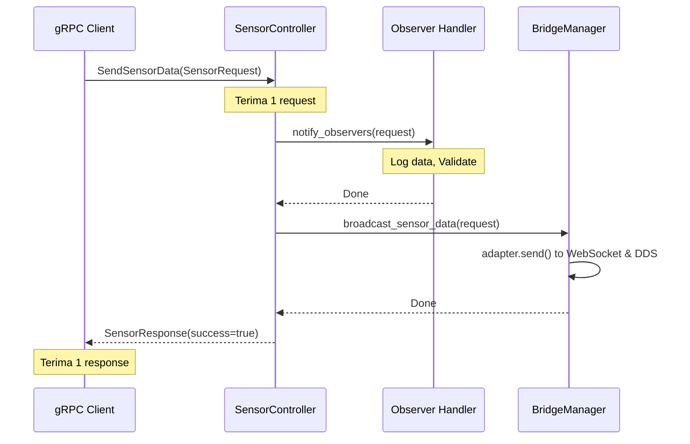

**Karakteristik:**
- **Request:** 1 × `SensorRequest`
- **Response:** 1 × `SensorResponse`
- **Alur:** Request masuk → Process → Response kembali (blocking)
- **Use Case:** Single sensor reading, one-time command, status query

**Implementation:**
```cpp
grpc::Status SensorController::SendSensorData(
    grpc::ServerContext* context,
    const iot::SensorRequest* request,
    iot::SensorResponse* response) {
    
    notify_observers(*request);        // Observer Pattern
    if (bridge_) {
        bridge_->broadcast_sensor_data(*request);  // Bridge Pattern
    }
    
    response->set_success(true);
    response->set_message("Data processed successfully");
    return grpc::Status::OK;
}
```

---

### B. Server Streaming — One Request, Multiple Responses

**Protobuf Definition:**
```protobuf
rpc MonitorSensor (SensorRequest) returns (stream SensorResponse);
```

**Sequence Diagram:**

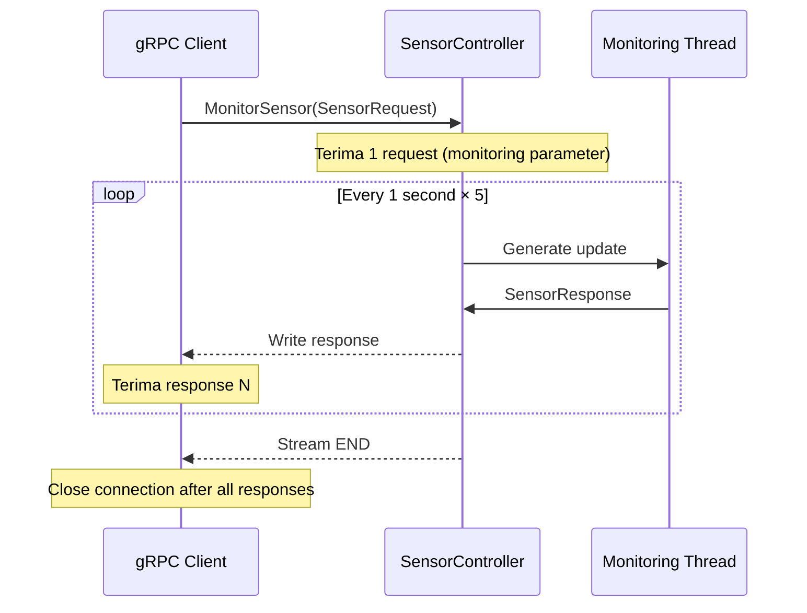

**Karakteristik:**
- **Request:** 1 × `SensorRequest` (parameter monitoring)
- **Response:** N × `SensorResponse` (streaming update)
- **Alur:** Server aktif mengirim data berkala sampai client close atau timeout
- **Use Case:** Live dashboard monitoring, continuous status updates, sensor polling

**Implementation:**
```cpp
grpc::Status SensorController::MonitorSensor(
    grpc::ServerContext* context,
    const iot::SensorRequest* request,
    grpc::ServerWriter<iot::SensorResponse>* writer) {
    
    spdlog::info("MonitorSensor started for sensor_id: {}", request->sensor_id());
    
    for (int i = 0; i < 5; ++i) {
        if (context->IsCancelled()) break;  // Client disconnect
        
        iot::SensorResponse response;
        response.set_success(true);
        response.set_message("Update #" + std::to_string(i + 1));
        writer->Write(response);
        
        std::this_thread::sleep_for(std::chrono::seconds(1));
    }
    
    return grpc::Status::OK;
}
```

---

### C. Client Streaming — Multiple Requests, Single Response

**Protobuf Definition:**
```protobuf
rpc StreamSensorData (stream SensorRequest) returns (SensorResponse);
```

**Sequence Diagram:**

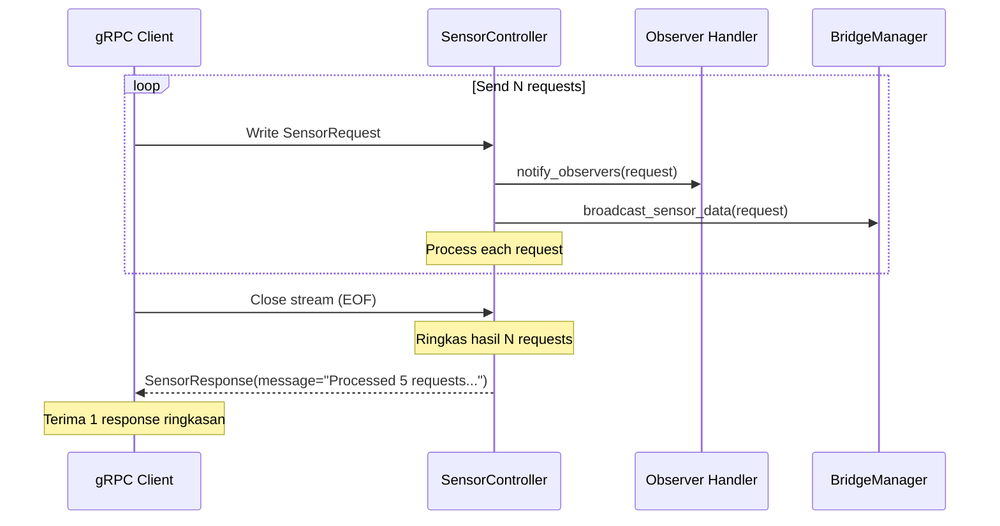

**Karakteristik:**
- **Request:** N × `SensorRequest` (streaming input)
- **Response:** 1 × `SensorResponse` (ringkasan akhir)
- **Alur:** Client mengirim N kali, server process semua, balas 1 ringkasan
- **Use Case:** Batch data upload, bulk sensor readings, transaction confirm

**Implementation:**
```cpp
grpc::Status SensorController::StreamSensorData(
    grpc::ServerContext* context,
    grpc::ServerReader<iot::SensorRequest>* reader,
    iot::SensorResponse* response) {
    
    iot::SensorRequest request;
    int count = 0;
    
    while (reader->Read(&request)) {  // Baca setiap request dari client
        spdlog::info("Received request #{}: sensor_id={}", ++count, request.sensor_id());
        
        notify_observers(request);     // Process each
        if (bridge_) {
            bridge_->broadcast_sensor_data(request);
        }
    }
    
    response->set_success(true);
    response->set_message("Processed " + std::to_string(count) + " requests");
    return grpc::Status::OK;
}
```

---

### D. Bidirectional Streaming — Full-Duplex Communication

**Protobuf Definition:**
```protobuf
rpc InteractiveSensor (stream SensorRequest) returns (stream SensorResponse);
```

**Sequence Diagram:**

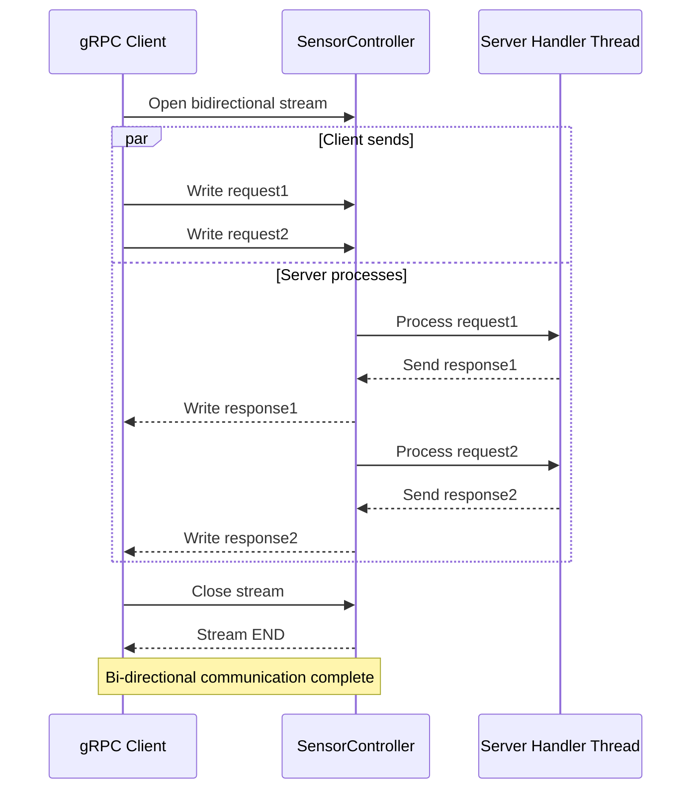

**Karakteristik:**
- **Request:** N × `SensorRequest` (streaming input dua arah)
- **Response:** N × `SensorResponse` (streaming output real-time)
- **Alur:** Simultaneous send-receive, full-duplex (bukan half-duplex)
- **Use Case:** Real-time chat-like control, interactive sensor command, two-way monitoring

**Implementation:**
```cpp
grpc::Status SensorController::InteractiveSensor(
    grpc::ServerContext* context,
    grpc::ServerReaderWriter<iot::SensorResponse, iot::SensorRequest>* stream) {
    
    iot::SensorRequest request;
    
    while (stream->Read(&request)) {  // Baca request dari client
        spdlog::info("Interactive mode - sensor_id: {}, temp: {}",
                     request.sensor_id(), request.temperature());
        
        notify_observers(request);     // Observer Pattern
        if (bridge_) {
            bridge_->broadcast_sensor_data(request);
        }
        
        // Echo + acknowledge back to client immediately
        iot::SensorResponse response;
        response.set_success(true);
        response.set_message("Acknowledged: " + request.sensor_name());
        stream->Write(response);      // Real-time response
    }
    
    return grpc::Status::OK;
}
```

---

### Comparison Table — Kapan Gunakan Apa?

| Pattern | Request | Response | Use Case | Latency | Throughput |
|---------|---------|----------|----------|---------|-----------|
| **Unary** | 1 | 1 | Single read/write, query | Low | Low |
| **Server Streaming** | 1 | N | Dashboard monitoring, live feed | Medium | Medium |
| **Client Streaming** | N | 1 | Batch upload, bulk operations | Medium | High |
| **Bidirectional** | N | N | Real-time interactive, chat | Low | Very High |

**Rekomendasi untuk IoT Bridge:**
- **Unary** ✅ untuk sensor individual yang jarang
- **Server Streaming** ✅ untuk real-time dashboard
- **Client Streaming** ✅ untuk batch sensor upload dari device
- **Bidirectional** ✅ untuk sensor yang sering dan interactive control

---

## 5.6 Extend gRPC Service — Menambah Request-Response Features

gRPC di project ini **BUKAN hanya untuk sensor data**. Anda bisa extend dengan berbagai jenis service. Berikut cara menambahkan feature baru:

### Scenario: Menambah Device Management Service (Control & Configuration)

**Step 1: Update Proto File**

Edit `proto/sensor.proto` dan tambahkan service baru:

```protobuf
syntax = "proto3";
package iot;

// ★ SERVICE EXISTING (tetap)
service SensorService {
  rpc SendSensorData (SensorRequest) returns (SensorResponse);
  rpc StreamSensorData (stream SensorRequest) returns (SensorResponse);
  rpc MonitorSensor (SensorRequest) returns (stream SensorResponse);
  rpc InteractiveSensor (stream SensorRequest) returns (stream SensorResponse);
}

// ★ SERVICE BARU: Device Management with Request-Response
service DeviceManagementService {
  // Unary: Get device config
  rpc GetDeviceConfig (GetConfigRequest) returns (DeviceConfig);
  
  // Unary: Update device config
  rpc SetDeviceConfig (SetConfigRequest) returns (SetConfigResponse);
  
  // Server Streaming: Get device logs
  rpc GetDeviceLogs (GetLogsRequest) returns (stream DeviceLog);
  
  // Bidirectional: Remote debug commands
  rpc DebugConsole (stream DebugCommand) returns (stream DebugOutput);
}

// Messages untuk DeviceManagementService
message GetConfigRequest {
  int32 device_id = 1;
}

message DeviceConfig {
  int32 device_id = 1;
  string device_name = 2;
  string firmware_version = 3;
  int32 poll_interval_ms = 4;
  bool enabled = 5;
}

message SetConfigRequest {
  int32 device_id = 1;
  DeviceConfig new_config = 2;
}

message SetConfigResponse {
  bool success = 1;
  string message = 2;
  DeviceConfig applied_config = 3;  // Echo konfigurasi yang di-apply
}

message GetLogsRequest {
  int32 device_id = 1;
  int32 limit = 2;  // Berapa log terakhir
}

message DeviceLog {
  int64 timestamp = 1;
  string level = 2;         // INFO, WARN, ERROR
  string message = 3;
  string source = 4;
}

message DebugCommand {
  string command = 1;       // "restart", "reset", "ping", dll
  map<string, string> params = 2;
}

message DebugOutput {
  bool success = 1;
  string output = 2;
  int64 execution_time_ms = 3;
}
```

**Step 2: Regenerate Proto Stubs**

```bash
cd /home/felixrdev/workspace/iot-integration-project
./generate_proto
# Output: sensor.pb.cc/h, sensor.grpc.pb.cc/h (updated dengan 2 service)
```

**Step 3: Buat Device Controller Class**

Buat file `src/controllers/device_controller.h`:

```cpp
#pragma once
#include "sensor.grpc.pb.h"
#include <grpcpp/grpcpp.h>
#include <spdlog/spdlog.h>
#include <memory>

class DeviceManager;  // Dependency (bisa menyimpan device state/config)

/**
 * DeviceController — gRPC Service untuk Device Management
 * 
 * Tugas:
 *   - GetDeviceConfig(id) → query device state
 *   - SetDeviceConfig(id, cfg) → update device config
 *   - GetDeviceLogs(id, limit) → streaming logs
 *   - DebugConsole(id) → bidirectional debug terminal
 */
class DeviceController final : public iot::DeviceManagementService::Service {
public:
    explicit DeviceController(std::shared_ptr<DeviceManager> device_manager);

    // ★ Unary: Query device state
    grpc::Status GetDeviceConfig(grpc::ServerContext* context,
                                 const iot::GetConfigRequest* request,
                                 iot::DeviceConfig* response) override;

    // ★ Unary: Modify device state
    grpc::Status SetDeviceConfig(grpc::ServerContext* context,
                                 const iot::SetConfigRequest* request,
                                 iot::SetConfigResponse* response) override;

    // ★ Server Streaming: Get logs continuously
    grpc::Status GetDeviceLogs(grpc::ServerContext* context,
                               const iot::GetLogsRequest* request,
                               grpc::ServerWriter<iot::DeviceLog>* writer) override;

    // ★ Bidirectional: Debug commands
    grpc::Status DebugConsole(grpc::ServerContext* context,
                             grpc::ServerReaderWriter<iot::DebugOutput, iot::DebugCommand>* stream) override;

private:
    std::shared_ptr<DeviceManager> device_manager_;
};
```

Buat file `src/controllers/device_controller.cpp`:

```cpp
#include "device_controller.h"
#include <spdlog/spdlog.h>
#include <chrono>

DeviceController::DeviceController(std::shared_ptr<DeviceManager> device_manager)
    : device_manager_(device_manager) {}

// ★ Unary: Get config
grpc::Status DeviceController::GetDeviceConfig(
    grpc::ServerContext* context,
    const iot::GetConfigRequest* request,
    iot::DeviceConfig* response) {
    
    int32_t device_id = request->device_id();
    spdlog::info("GetDeviceConfig: device_id={}", device_id);
    
    // Retrieve config dari device_manager
    if (device_manager_) {
        auto config = device_manager_->get_config(device_id);
        if (config) {
            response->set_device_id(config->device_id);
            response->set_device_name(config->device_name);
            response->set_firmware_version(config->firmware_version);
            response->set_poll_interval_ms(config->poll_interval_ms);
            response->set_enabled(config->enabled);
            return grpc::Status::OK;
        }
    }
    
    return grpc::Status(grpc::StatusCode::NOT_FOUND,
                       "Device not found: " + std::to_string(device_id));
}

// ★ Unary: Set config
grpc::Status DeviceController::SetDeviceConfig(
    grpc::ServerContext* context,
    const iot::SetConfigRequest* request,
    iot::SetConfigResponse* response) {
    
    int32_t device_id = request->device_id();
    spdlog::info("SetDeviceConfig: device_id={}", device_id);
    
    if (device_manager_) {
        bool success = device_manager_->set_config(device_id, request->new_config());
        response->set_success(success);
        response->set_message(success ? "Config updated successfully" : "Failed to update");
        
        if (success) {
            auto applied = device_manager_->get_config(device_id);
            response->mutable_applied_config()->CopyFrom(*applied);
        }
        return grpc::Status::OK;
    }
    
    return grpc::Status(grpc::StatusCode::INTERNAL, "DeviceManager not available");
}

// ★ Server Streaming: Get logs
grpc::Status DeviceController::GetDeviceLogs(
    grpc::ServerContext* context,
    const iot::GetLogsRequest* request,
    grpc::ServerWriter<iot::DeviceLog>* writer) {
    
    int32_t device_id = request->device_id();
    int32_t limit = request->limit();
    spdlog::info("GetDeviceLogs: device_id={}, limit={}", device_id, limit);
    
    if (device_manager_) {
        auto logs = device_manager_->get_logs(device_id, limit);
        
        // Write each log entry to stream
        for (const auto& log : logs) {
            iot::DeviceLog pb_log;
            pb_log.set_timestamp(log.timestamp);
            pb_log.set_level(log.level);
            pb_log.set_message(log.message);
            pb_log.set_source(log.source);
            
            if (!writer->Write(pb_log)) {
                break;  // Client disconnected
            }
        }
        return grpc::Status::OK;
    }
    
    return grpc::Status(grpc::StatusCode::INTERNAL, "DeviceManager not available");
}

// ★ Bidirectional: Debug console
grpc::Status DeviceController::DebugConsole(
    grpc::ServerContext* context,
    grpc::ServerReaderWriter<iot::DebugOutput, iot::DebugCommand>* stream) {
    
    spdlog::info("DebugConsole: Client connected");
    
    iot::DebugCommand command;
    while (stream->Read(&command)) {
        spdlog::info("DebugConsole: Received command: {}", command.command());
        
        auto start = std::chrono::high_resolution_clock::now();
        
        // Execute command (bisa via device_manager_)
        std::string output;
        bool success = false;
        
        if (command.command() == "ping") {
            output = "PONG";
            success = true;
        } else if (command.command() == "restart") {
            output = "Device restart initiated...";
            success = true;
        } else {
            output = "Unknown command: " + command.command();
            success = false;
        }
        
        auto end = std::chrono::high_resolution_clock::now();
        auto duration = std::chrono::duration_cast<std::chrono::milliseconds>(end - start);
        
        // Send response
        iot::DebugOutput response;
        response.set_success(success);
        response.set_output(output);
        response.set_execution_time_ms(duration.count());
        
        if (!stream->Write(response)) {
            break;  // Client disconnected
        }
    }
    
    spdlog::info("DebugConsole: Client disconnected");
    return grpc::Status::OK;
}
```

**Step 4: Wiring di `app.cpp`**

Daftarkan `DeviceController` ke `ServerBuilder`:

```cpp
int main(int argc, char* argv[]) {
    // ... existing setup ...
    
    // ★ Register SensorController (existing)
    auto sensor_service = std::make_shared<SensorController>(g_bridge);
    sensor_service->add_observer(log_handler);
    sensor_service->add_observer(validator);
    
    // ★ Register DeviceController (NEW)
    auto device_manager = std::make_shared<DeviceManager>();  // Create manager
    auto device_service = std::make_shared<DeviceController>(device_manager);
    
    grpc::ServerBuilder builder;
    builder.AddListeningPort("0.0.0.0:50051", grpc::InsecureServerCredentials());
    builder.RegisterService(sensor_service.get());    // Register service
    builder.RegisterService(device_service.get());    // Register NEW service
    
    auto server = builder.BuildAndStart();
    // ... rest of setup ...
}
```

**Result:**
```
Kini Anda punya 2 gRPC services dalam 1 binary:
- SensorService       → 4 streaming methods (unary, server, client, bidi)
- DeviceManagementService → 4 management methods (unary, unary, server, bidi)

Dalam satu port 50051, kedua service bisa diakses bersamaan!
```

---

## 6. Diagram — Arsitektur Keseluruhan

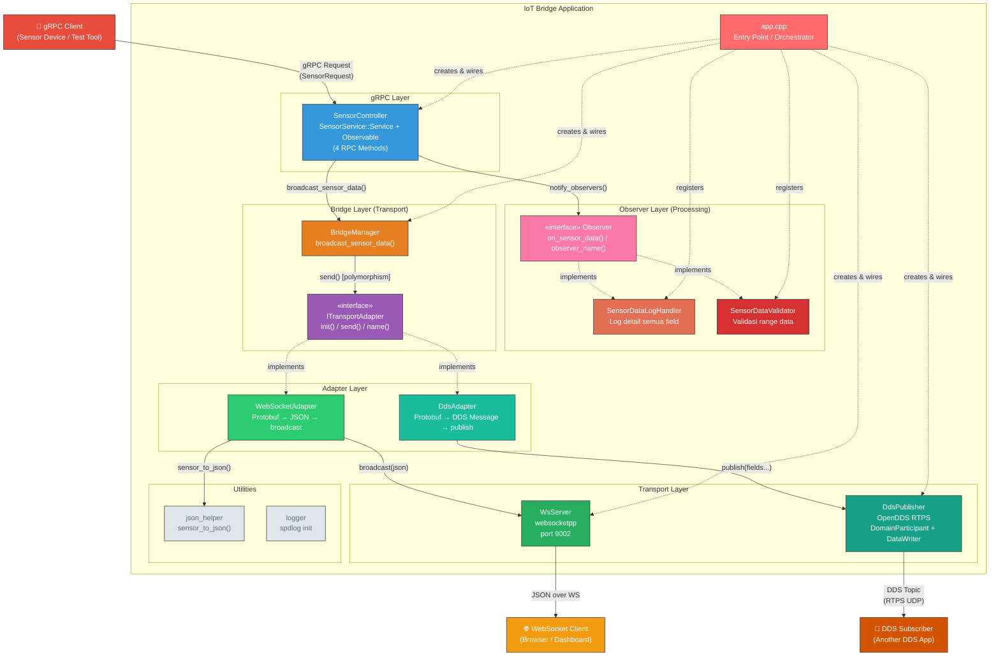

---

## 7. Diagram — Class Hierarchy (OOP)

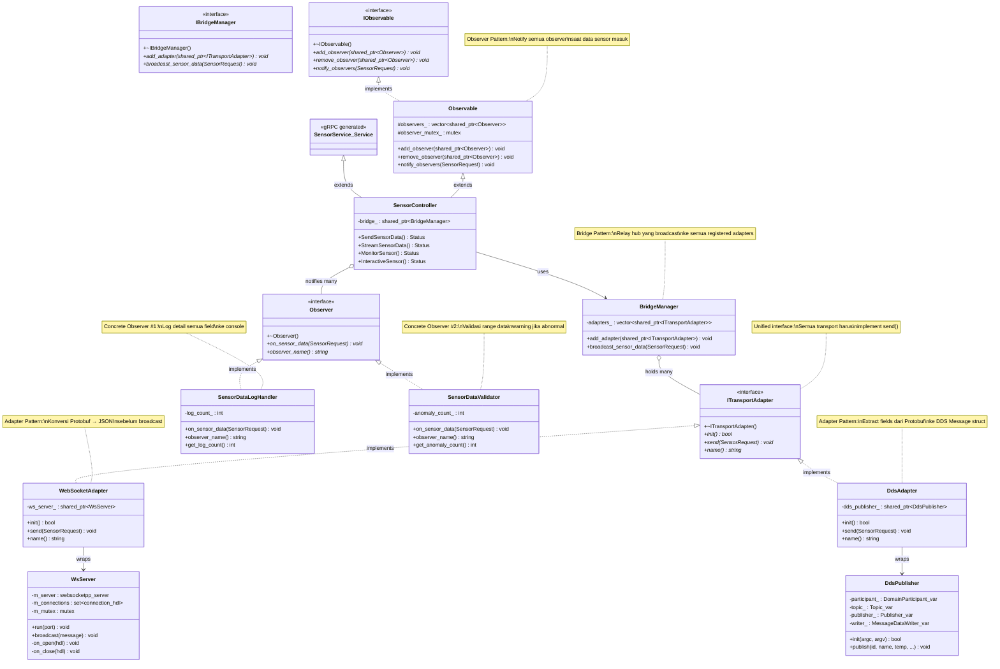

---

## 8. Diagram — Data Flow (Sensor Data Pipeline)

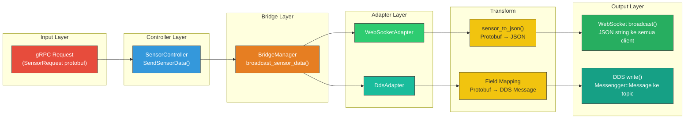

### Data Transformation Detail

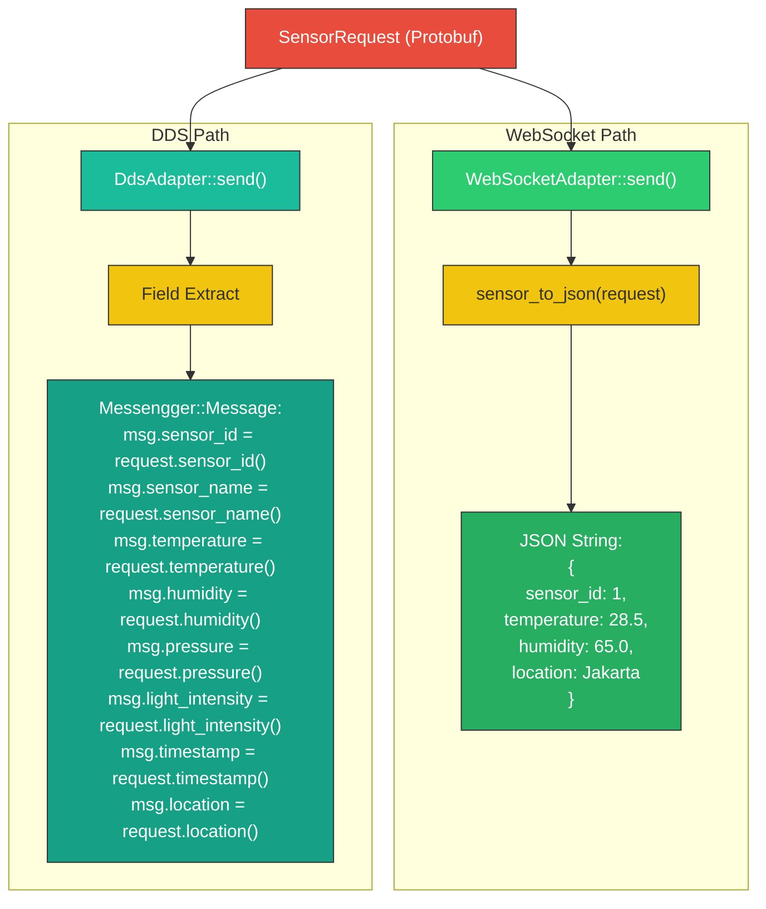

---

## 9. Diagram — Sequence (Alur Runtime)

### 9.1 Startup Sequence

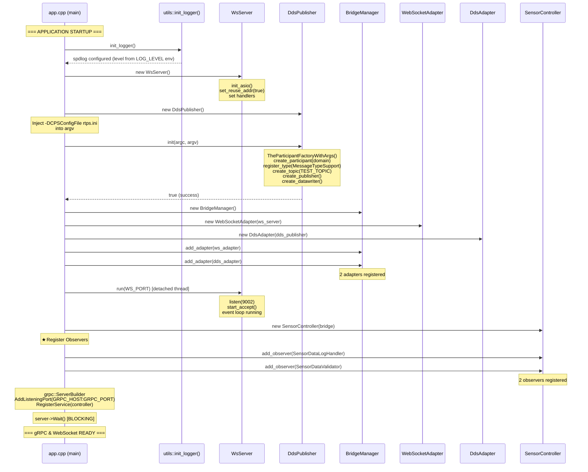

### 9.2 Request Processing Sequence (Unary)

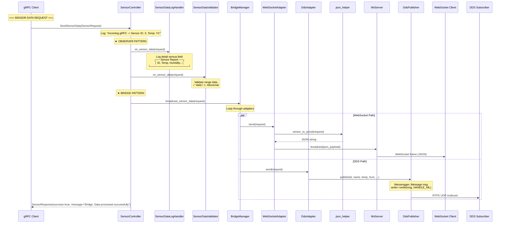

---

## 10. Diagram — Proto & IDL Code Generation

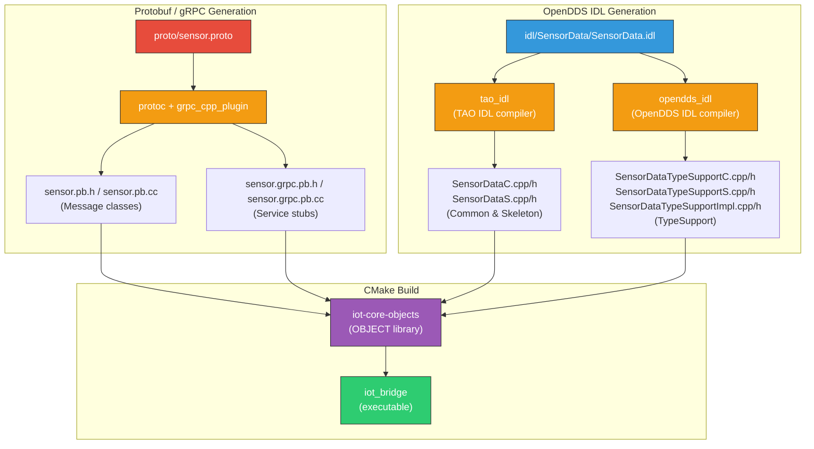

### Generation Commands

```bash
# Proto generation (otomatis via CMake, atau manual):
./generate_proto

# IDL generation (manual, karena tao_idl tidak ada di Conan):
./generate_idl
```

---

## 11. Diagram — Folder Structure

```mermaid
graph TB
    ROOT["iot-integration-project/"]

    ROOT --> CMAKE["CMakeLists.txt<br/>Build System"]
    ROOT --> DOCKERFILE["Dockerfile<br/>Multi-stage Build"]
    ROOT --> COMPOSE["docker-compose.yaml<br/>Orchestration"]
    ROOT --> CONAN["conanfile.txt<br/>13 Dependencies"]
    ROOT --> ENV[".env / .env.example<br/>Runtime Config"]
    ROOT --> RTPS["rtps.ini<br/>RTPS Discovery"]
    ROOT --> GEN_P["generate_proto<br/>Proto Script"]
    ROOT --> GEN_I["generate_idl<br/>IDL Script"]

    ROOT --> BUILD["build/<br/>Conan Generated"]
    ROOT --> DOCKER["docker/<br/>CMakeLists.txt"]
    ROOT --> IDL["idl/"]
    ROOT --> PROTO["proto/"]
    ROOT --> SRC["src/"]

    IDL --> SENSOR_IDL["SensorData/<br/>SensorData.idl<br/>+ 10 generated files"]
    PROTO --> SENSOR_PROTO["sensor.proto<br/>4 RPC Methods"]

    SRC --> APP["app.cpp<br/>★ Entry Point"]
    SRC --> ADAPTERS["adapters/"]
    SRC --> CONTROLLERS["controllers/"]
    SRC --> DDS_DIR["dds/"]
    SRC --> HANDLERS["handlers/"]
    SRC --> UTILS["utils/"]
    SRC --> WEBSOCKET["websocket/"]

    ADAPTERS --> ABS_ADAPT["abstract_adapters/observable/<br/>interface_observable.h<br/>observable.h"]
    ADAPTERS --> INT_ADAPT["interface_adapters/<br/>ITransportAdapter<br/>IBridgeManager"]
    ADAPTERS --> SVC_ADAPT["service_adapters/"]

    SVC_ADAPT --> BM_FILE["bridge_manager.h/cpp<br/>★ Bridge Hub"]
    SVC_ADAPT --> DDS_ADAPT["dds_adapters/<br/>dds_adapter.h/cpp"]
    SVC_ADAPT --> WS_ADAPT["websocket_adapters/<br/>websocket_adapter.h/cpp"]

    CONTROLLERS --> SC_FILE["sensor_controller.h/cpp<br/>gRPC + Observable"]

    DDS_DIR --> DDS_PUB["dds_publisher.h/cpp<br/>OpenDDS Pipeline"]

    HANDLERS --> OBS["observer/<br/>observer.h"]
    HANDLERS --> LOG_HANDLER["sensor_data_log_handler/<br/>★ Log Detail Data"]
    HANDLERS --> VAL_HANDLER["sensor_data_validator/<br/>★ Validasi Range"]

    UTILS --> JH["json_helper.h<br/>Protobuf → JSON"]
    UTILS --> LOG_UTIL["log_util/<br/>logger.h"]

    WEBSOCKET --> WS_FILE["ws_server.h/cpp<br/>WebSocket Server"]

    style ROOT fill:#2c3e50,stroke:#333,color:#fff
    style SRC fill:#3498db,stroke:#333,color:#fff
    style ADAPTERS fill:#9b59b6,stroke:#333,color:#fff
    style SVC_ADAPT fill:#8e44ad,stroke:#333,color:#fff
    style BM_FILE fill:#e67e22,stroke:#333,color:#fff
    style SC_FILE fill:#3498db,stroke:#333,color:#fff
    style DDS_PUB fill:#1abc9c,stroke:#333,color:#fff
    style WS_FILE fill:#27ae60,stroke:#333,color:#fff
    style APP fill:#ff6b6b,stroke:#333,color:#fff
    style IDL fill:#16a085,stroke:#333,color:#fff
    style PROTO fill:#e74c3c,stroke:#333,color:#fff
    style LOG_HANDLER fill:#e17055,stroke:#333,color:#fff
    style VAL_HANDLER fill:#d63031,stroke:#333,color:#fff
```

---

## 12. Cara Kerja Aplikasi (Step by Step)

### Phase 1: Initialization

1. **`main()` dipanggil di `app.cpp`**
   - `utils::init_logger()` → setup spdlog, baca `LOG_LEVEL` dari env
   - Output: `"Logger module initialized (level: info)"`

2. **WebSocket Server dibuat**
   - `WsServer()` → init Boost.Asio, set `reuse_addr(true)`, register open/close handlers
   - Belum listen — hanya setup

3. **DDS Publisher dibuat & diinisialisasi**
   - `DdsPublisher()` → semua member `nullptr`
   - Inject `-DCPSConfigFile rtps.ini` ke argument list
   - `init(argc, argv)`:
     - Parse RTPS config → RTPS discovery aktif (tanpa InfoRepo)
     - Buat `DomainParticipant` di domain dari env `DDS_DOMAIN`
     - Register type `Messengger::Message` dari generated IDL
     - Buat topic dari env `TEST_TOPIC` (default: `TestData_Msg`)
     - Buat `Publisher` → `DataWriter` → narrow ke `MessageDataWriter`
   - Output: `"DDS: Initialized successfully (domain=0, topic=TestData_Msg)"`

4. **Bridge Manager dibuat & adapters diregistrasi**
   - `BridgeManager()` → vector kosong
   - `WebSocketAdapter(ws_server)` → adapter membungkus WsServer
   - `DdsAdapter(dds_publisher)` → adapter membungkus DdsPublisher
   - `add_adapter(ws_adapter)` → log: `"Bridge: Adapter registered - WebSocket"`
   - `add_adapter(dds_adapter)` → log: `"Bridge: Adapter registered - DDS"`
   - Output: `"Bridge: Initialized with 2 adapters"`

### Phase 2: Server Startup

5. **WebSocket server dijalankan di thread terpisah (detached)**
   - `WsServer::run(9002)` → `listen()` → `start_accept()` → event loop
   - Output: `"[WebSocket] Listening on port 9002"`

6. **gRPC server dijalankan di main thread + observer registration**
   - Buat `SensorController(bridge)` sebagai gRPC service
   - **Register observers:**
     - `SensorDataLogHandler` → observer #1 (log detail data)
     - `SensorDataValidator` → observer #2 (validasi range data)
   - Output: `"Observable: Observer registered - SensorDataLogHandler"`
   - Output: `"Observable: Observer registered - SensorDataValidator"`
   - Output: `"Observers: Registered 2 handler(s) to SensorController"`
   - `grpc::ServerBuilder` → `AddListeningPort("0.0.0.0:50051")`
   - `server->Wait()` → **blocking** — main thread menunggu request selamanya
   - Output: `"[gRPC] Server active at 0.0.0.0:50051"`

### Phase 3: Request Processing

7. **gRPC client mengirim `SendSensorData(SensorRequest)` ke port 50051**
   - `SensorController::SendSensorData()` dipanggil
   - Log: `"Incoming gRPC -> Sensor ID: 1, Temp: 28.5C"`

8. **Observer Pattern: notify semua observer**
   - `notify_observers(request)` dipanggil
   - **SensorDataLogHandler** → log semua field:
     ```
     ┌─────────── [DataLogger] Sensor Report ───────────┐
     │ Sensor ID      : 1
     │ Temperature    : 28.5°C
     │ Humidity       : 65.0%
     │ Pressure       : 1013.25 hPa
     │ Location       : Jakarta
     └─────────────────────────────────────────────────┘
     ```
   - **SensorDataValidator** → validasi semua field:
     - Temperature 28.5°C → ✓ dalam range (-50 ~ 100)
     - Humidity 65% → ✓ dalam range (0 ~ 100)
     - Output: `"[Validator] ✓ Data valid — Sensor ID: 1, Temp: 28.5°C"`

9. **Bridge Pattern: broadcast ke semua adapter**
   - Panggil `bridge_->broadcast_sensor_data(request)`

10. **BridgeManager meneruskan data ke semua adapter**
   - Loop `adapters_`:
     - `WebSocketAdapter::send(request)` dipanggil
     - `DdsAdapter::send(request)` dipanggil

11. **WebSocket path:**
   - `sensor_to_json(&request)` → konversi ke JSON string
   - `ws_server_->broadcast(json)` → kirim ke semua connected WebSocket client
   - Browser menerima: `{"sensor_id":1,"temperature":28.5,"humidity":65.0,"location":"Jakarta"}`

12. **DDS path:**
    - `dds_publisher_->publish(id, name, temp, hum, ...)` dipanggil
    - Buat `Messengger::Message`, isi semua field
    - `writer_->write(msg, DDS::HANDLE_NIL)` → publish ke RTPS domain
    - Log: `"DDS: Published - ID: 1, Name: TempSensor, Temp: 28.5C"`
    - DDS subscriber di jaringan yang sama menerima data via RTPS UDP multicast

13. **Response dikembalikan ke gRPC client**
    - `SensorResponse(success=true, message="Bridge: Data processed successfully")`

### Phase 4: Streaming Modes

14. **Client Streaming** (`StreamSensorData`) — client kirim banyak `SensorRequest` sekaligus:
    - Server baca loop `reader->Read(&request)`, **notify observers** + relay setiap message ke bridge
    - Setelah stream selesai, return ringkasan

15. **Server Streaming** (`MonitorSensor`) — server kirim 5 response update:
    - Menerima satu request, kemudian kirim 5 `SensorResponse` dengan interval 1 detik
    - Berguna untuk monitoring real-time

16. **Bidirectional** (`InteractiveSensor`) — ping-pong:
    - Baca request → **notify observers** → relay ke bridge → echo response kembali ke client
    - Session berlanjut sampai client menutup stream

### Kesimpulan Alur

```
gRPC Client ──► SensorController ──┬──► notify_observers() ──┬──► SensorDataLogHandler (log)
                                   │                         └──► SensorDataValidator (validate)
                                   │
                                   └──► BridgeManager ──┬──► WebSocketAdapter ──► WsServer ──► Browser
                                                        └──► DdsAdapter ──► DdsPublisher ──► DDS Domain
```

Setiap data sensor melewati **satu pintu masuk** (gRPC), diproses oleh **Observer Pattern** (log + validasi), lalu dikirim melalui **dua pintu keluar** (WebSocket + DDS) via **Bridge Pattern**.

---

## 13. Docker Deployment

### 13.1 Multi-Stage Dockerfile

```
┌─────────────────────────────────────────────┐
│          BUILD STAGE (ubuntu:22.04)          │
│                                             │
│  1. Install build tools (gcc, cmake, perl)  │
│  2. Download & build OpenDDS 3.29.1         │
│     ./configure && make -j$(nproc)          │
│  3. Install Conan, conan install deps       │
│  4. Copy source code + docker/CMakeLists    │
│  5. cmake --preset conan-release && build   │
│                                             │
│  Output: /app/build/iot_bridge (binary)     │
└───────────────────┬─────────────────────────┘
                    │ COPY binary + libs
                    ▼
┌─────────────────────────────────────────────┐
│        RUNTIME STAGE (ubuntu:22.04)         │
│                                             │
│  - libstdc++6, ca-certificates, libssl3     │
│  - /app/build/iot_bridge (binary)           │
│  - /app/build/rtps.ini (config)             │
│  - /opt/OpenDDS/lib (runtime .so files)     │
│  - /opt/OpenDDS/ACE_wrappers/lib            │
│  - Non-root user: iotuser                   │
│  - CMD ["./iot_bridge"]                     │
└─────────────────────────────────────────────┘
```

### 13.2 Docker Compose

```yaml
services:
  iot-bridge:
    build:
      context: .
      dockerfile: Dockerfile
    image: iot-bridge-app:v1.0
    env_file: .env                    # Semua config dari .env
    ports:
      - "${GRPC_PORT}:${GRPC_PORT}"   # gRPC (default: 50051)
      - "${WS_PORT}:${WS_PORT}"       # WebSocket (default: 9002)
    environment:
      - DDS_CONFIG_FILE=${DDS_CONFIG_FILE}  # rtps.ini
    networks:
      - iot-internal-network
    restart: always
```

### 13.3 Build & Run

```bash
# Build Docker image
docker compose build

# Run container
docker compose up -d

# Check logs
docker compose logs -f iot-bridge

# Stop
docker compose down
```

---

## 14. Environment Variables

| Variable | Default | Penjelasan |
|----------|---------|-----------|
| `GRPC_HOST` | `0.0.0.0` | gRPC server bind address |
| `GRPC_PORT` | `50051` | gRPC server port |
| `WS_PORT` | `9002` | WebSocket server port |
| `DDS_DOMAIN` | `0` | OpenDDS domain ID |
| `DDS_CONFIG_FILE` | `rtps.ini` | Path ke file config RTPS |
| `LOG_LEVEL` | `info` | spdlog level (trace/debug/info/warn/error/critical) |
| `TEST_TOPIC` | `TestData_Msg` | Nama DDS topic |

**Local dev only (.env):**
| Variable | Penjelasan |
|----------|-----------|
| `OPENDDS_HOME` | Path instalasi OpenDDS (e.g., `/home/user/opt/OpenDDS/OpenDDS-3.29.1`) |
| `ACE_ROOT` | Path ACE wrappers (`$OPENDDS_HOME/ACE_wrappers`) |
| `TAO_ROOT` | Path TAO (`$ACE_ROOT/TAO`) |
| `MPC_ROOT` | Path MPC (`$OPENDDS_HOME/MPC`) |
| `LD_LIBRARY_PATH` | Include `$ACE_ROOT/lib:$OPENDDS_HOME/lib` |
| `PATH` | Include `$ACE_ROOT/bin:$OPENDDS_HOME/bin` |

---

## 15. Cara Generate Proto & IDL Stubs

### 15.1 Proto Generation

```bash
# Otomatis via CMake (saat build):
cmake --preset conan-release && cmake --build build

# Manual via script:
./generate_proto
```

Script `generate_proto` menjalankan:
```bash
protoc --cpp_out=proto/ --grpc_out=proto/ \
       --plugin=protoc-gen-grpc=grpc_cpp_plugin \
       -I proto/ proto/sensor.proto
```

**Output:** `sensor.pb.h`, `sensor.pb.cc`, `sensor.grpc.pb.h`, `sensor.grpc.pb.cc`

### 15.2 IDL Generation

```bash
# Manual via script (membutuhkan OpenDDS terinstall):
./generate_idl
```

Script `generate_idl` menjalankan:
```bash
cd idl/SensorData/
$TAO_ROOT/bin/tao_idl SensorData.idl
$OPENDDS_HOME/bin/opendds_idl SensorData.idl
```

**Output (10 files):**
| File | Fungsi |
|------|--------|
| `SensorDataC.cpp/h` | Common types & client stubs |
| `SensorDataS.cpp/h` | Server/skeleton stubs |
| `SensorDataTypeSupportC.cpp/h` | TypeSupport client code |
| `SensorDataTypeSupportS.cpp/h` | TypeSupport skeleton code |
| `SensorDataTypeSupportImpl.cpp/h` | TypeSupport implementation (register/create) |
| `SensorDataTypeSupport.idl` | Generated IDL untuk TypeSupport |

---

## RTPS Discovery (rtps.ini)

```ini
[common]
DCPSDefaultDiscovery=DEFAULT_RTPS    ; Gunakan RTPS discovery (bukan InfoRepo)
DCPSGlobalTransportConfig=$file

[transport/the_rtps_transport]
transport_type=rtps_udp              ; Transport via UDP multicast
```

**Mengapa RTPS?**
- **Tidak perlu InfoRepo** (centralized discovery service) — peer-to-peer
- Cocok untuk deployment Docker/Kubernetes
- Otomatis discovery via UDP multicast
- Config diinject programmatically via `-DCPSConfigFile rtps.ini` di `app.cpp`

---

> **Catatan:** Project ini menggabungkan arsitektur dari 4 project template sebelumnya (`cpp-simple-project`, `simple-grpc-cpp`, `simple-websocket-cpp`, `simple-odds-cpp`) menjadi satu aplikasi IoT Bridge yang utuh. Bridge Pattern memungkinkan penambahan transport baru (MQTT, Kafka, HTTP) tanpa mengubah logika bisnis yang sudah ada.
